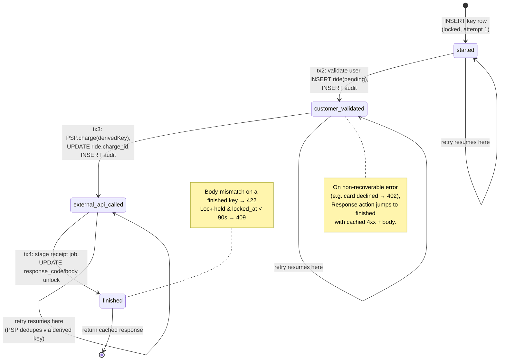
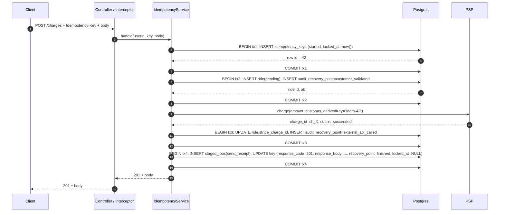
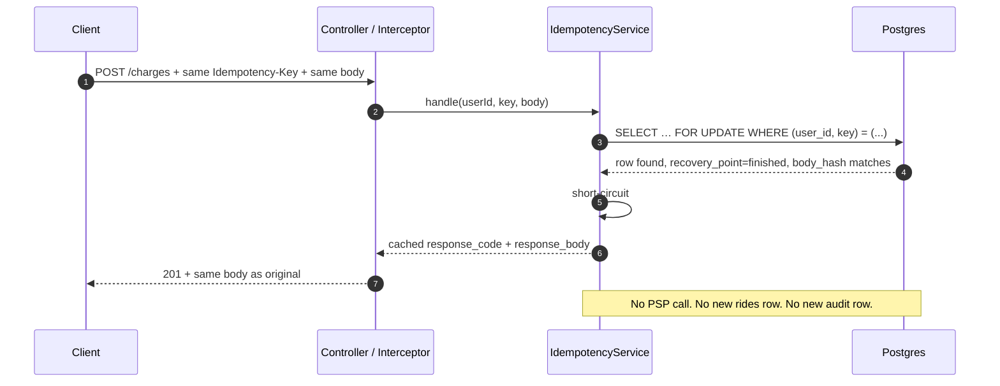
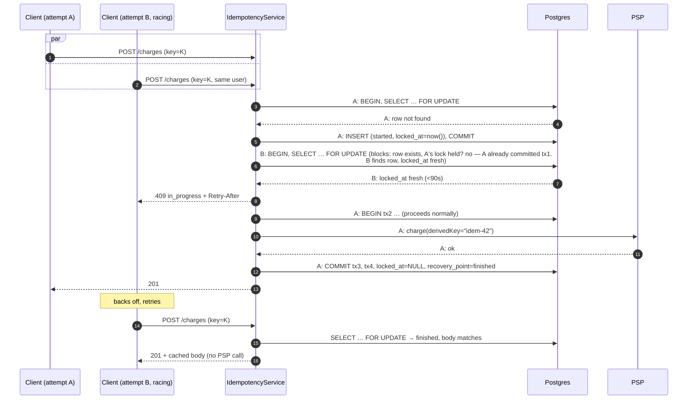
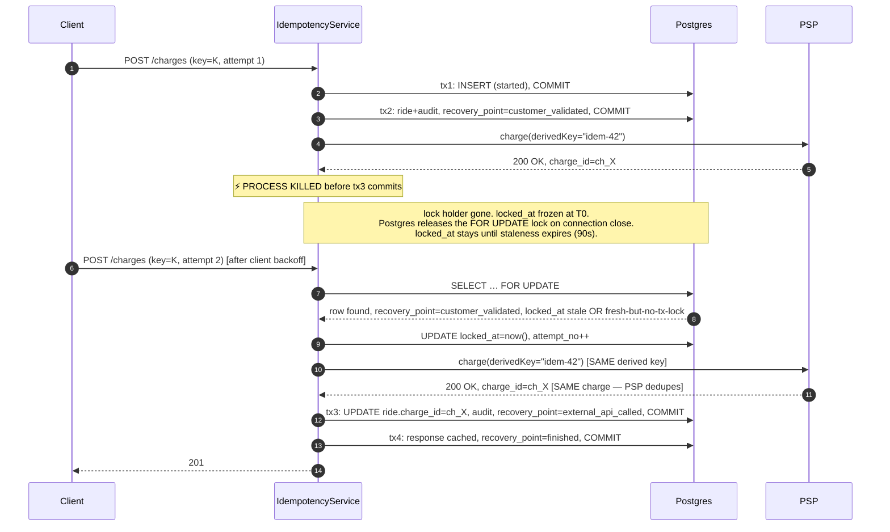

# Phase 3 — System Design & Architecture

> Diagrams render on GitHub natively (Mermaid). Cross-references: PRD.md, TRD.md.

## 1. Component diagram

```mermaid
flowchart LR
    Client[Merchant Client<br/>retries on 5xx/409/conn-err]
    Controller[ChargesController<br/>POST /charges]
    Interceptor[IdempotencyInterceptor<br/>extract + validate header]
    IdemSvc[IdempotencyService<br/>state machine + lock]
    ChargeSvc[ChargeService<br/>business logic]
    Ext[ExternalPaymentClient<br/>derived idempotency key]
    Repo[IdempotencyKeyRepository]
    AuditRepo[AuditLogRepository]
    PG[(PostgreSQL 15<br/>idempotency_keys<br/>rides, audit_logs)]
    PSP[(External PSP<br/>e.g. Stripe)]

    Client -->|Idempotency-Key header| Controller
    Controller --> Interceptor
    Interceptor --> IdemSvc
    IdemSvc -->|each phase = REQUIRES_NEW TX| Repo
    IdemSvc -->|each transition| AuditRepo
    IdemSvc -->|delegates business phase| ChargeSvc
    ChargeSvc -->|derived key idem-${row_id}| Ext
    Ext --> PSP
    Repo --> PG
    AuditRepo --> PG
```

The interceptor is the front door: it pulls the header, validates the format, attaches the resolved `user_id`, and hands the request to `IdempotencyService`. The service owns the entire lifecycle: locking, fingerprint compare, state-machine loop, recovery-point commits. Business logic lives in `ChargeService`. The external call sits behind `ExternalPaymentClient` which *requires* a derived idempotency key as a method parameter — accidental omission is a compile error.

## 2. State machine



Phases (DAG, never backward):

- `started`: row exists, lock acquired, nothing else committed.
- `customer_validated`: user resolved, `rides` row inserted with no `stripe_charge_id`.
- `external_api_called`: PSP charge succeeded, `stripe_charge_id` persisted.
- `finished`: response cached on the key row, lock released, receipt job staged.

## 3. Sequence diagrams

### 3.1 Happy path



### 3.2 Duplicate key, cached return



### 3.3 Two concurrent requests + locking



### 3.4 Crash mid-PSP-call → resume



The crucial property: the second attempt's PSP call carries the same `idem-42`. The PSP returns the same `charge_id=ch_X` from its own idempotency cache. **No double charge.**

## 4. Concurrency model

Two layers of mutual exclusion:

1. **Postgres row lock (`SELECT … FOR UPDATE`).** Held only within a single TX. Guards the *current* transaction's view of the row from concurrent writers. Released on `COMMIT`/`ROLLBACK`/connection-close.

2. **`locked_at` timestamp.** Held *across* transactions to detect "someone is currently mid-request". Inspected by every entrant:

```
acquire(userId, key):
   BEGIN
   row = SELECT … FROM idempotency_keys WHERE (user_id,key)=(...) FOR UPDATE
   if row is null:
       INSERT (started, locked_at=now())
       COMMIT
       return ACQUIRED_FRESH
   if row.recovery_point == 'finished':
       COMMIT
       return SERVE_CACHE(row.response_code, row.response_body)
   if row.request_params_hash != hash(body):
       COMMIT
       return 422
   if row.locked_at IS NOT NULL AND row.locked_at > now() - 90s:
       COMMIT
       return 409                          # holder still alive
   UPDATE locked_at=now(), attempt_no = attempt_no + 1
   COMMIT
   return ACQUIRED_RESUME(row.recovery_point)
```

The 90-second staleness threshold is the recovery primitive: it's how a dead holder's row gets reclaimed without human intervention. It must be longer than the longest legitimate request (PSP timeout = 80s) so we don't reclaim live holders.

### Why deadlock is impossible

Every transaction in IdempotencyService locks **exactly one** `idempotency_keys` row, identified uniquely by `(user_id, key)`. Phase transactions never lock a second row of the same table. `rides`/`audit_logs` writes are inserts (no `FOR UPDATE`), and they reference distinct row ids per request. Two transactions can never hold locks on the same pair of rows in opposite order. Postgres's cycle-detection deadlock checker therefore never triggers.

### Why double-execution is impossible

Two concurrent attempts on the same `(user_id, key)`:

- Both `SELECT … FOR UPDATE` on the same row.
- Postgres serializes them: one acquires, one waits.
- If the row didn't exist, the loser sees a unique-constraint violation on its INSERT and retries the SELECT, finding the row this time.
- The winner of the lock either (a) commits its `started` row and exits tx1; (b) sees `finished` and serves cache; (c) sees fresh `locked_at` (impossible if it just took the row lock) — or (d) acquires by stamping `locked_at`. In every case, exactly one attempt is the holder; the other sees `locked_at` fresh and gets 409.

## 5. Failure-point inventory (~8 points)

Mapped to RESEARCH.md §5, with the test that proves each in Phase 8.

| # | Where | Mechanism that recovers it | Test |
|---|---|---|---|
| F1 | Client → server before tx1 begins | No state to recover; client retries; tx1 runs cleanly. | `testHappyPath` (degenerate) |
| F2 | Mid-tx1 (between INSERT and COMMIT) | tx1 rolls back atomically; no row; client retry creates it. | `testCrashDuringTx1Recovers` |
| F3 | Between tx1 commit and tx2 begin | `started` row exists, locked. On retry: `locked_at` stale → reclaim → resume at `started`. | `testCrashBetweenTxRecovers` (started variant) |
| F4 | Mid-tx2 | tx2 rolls back; row still at `started`. Retry resumes from `started`. No partial ride row (rolled back). | `testCrashMidTx2RollsBackRide` |
| F5 | Mid-PSP call (network timeout) | tx3 never opened; row at `customer_validated`. Retry calls PSP again with same derived key — PSP returns same charge_id. | `testCrashDuringExternalApiCallNoDoubleCharge` |
| F6 | After PSP 200, before tx3 commit | Row at `customer_validated`; retry calls PSP again with derived key → PSP cache hit → same charge_id → tx3 commits. **This is the critical case.** | `testCrashAfterPspBeforeCommit` |
| F7 | Mid-tx4 (between staging job and response cache) | tx4 rolls back atomically; row at `external_api_called` with `stripe_charge_id` persisted. Retry resumes at `external_api_called`; no PSP call needed; stages job idempotently (the staged_jobs INSERT carries `(idempotency_key_id, kind)` UNIQUE so re-INSERT is a no-op via ON CONFLICT DO NOTHING). | `testCrashMidTx4Recovers` |
| F8 | After tx4 commits, before HTTP response reaches client | Row at `finished` with cached body. Retry hits `finished` → returns cached body. | `testCrashAfterFinishedBeforeResponse` |

Total: 8 distinct failure modes; each maps to a transaction boundary or a network boundary. Every one ends with: customer charged exactly once, response identical on retry.

## 6. Process layout (single instance)

```mermaid
flowchart TB
    subgraph App[Spring Boot app]
        H[HTTP listener<br/>Tomcat]
        SM[IdempotencyService<br/>state machine]
        R[Reaper<br/>@Scheduled hourly]
        D[Job drain<br/>@Scheduled 5s]
    end
    PG[(Postgres)]
    PSP[(PSP)]
    Mail[(SMTP / Mailgun)]

    H --> SM
    SM --> PG
    SM --> PSP
    R --> PG
    D --> PG
    D --> Mail
```

- **Reaper:** `@Scheduled(fixedDelay = 1h)` — `DELETE FROM idempotency_keys WHERE expires_at < now()`.
- **Job drain:** `@Scheduled(fixedDelay = 5s)` — pulls from `staged_jobs`, sends receipts, deletes processed rows. Brandur's "transactionally-staged job drain" pattern.

Future: split reaper and drain into separate processes for HA. v1 keeps them in-process to minimize moving pieces.

---

**Sources:**

- [Designing robust and predictable APIs with idempotency — Stripe](https://stripe.com/blog/idempotency)
- [Implementing Stripe-like Idempotency Keys in Postgres — brandur.org](https://brandur.org/idempotency-keys)
- [Idempotency and Retry Logic — stripe/stripe-node, DeepWiki](https://deepwiki.com/stripe/stripe-node/3.5-idempotency-and-retry-logic)
