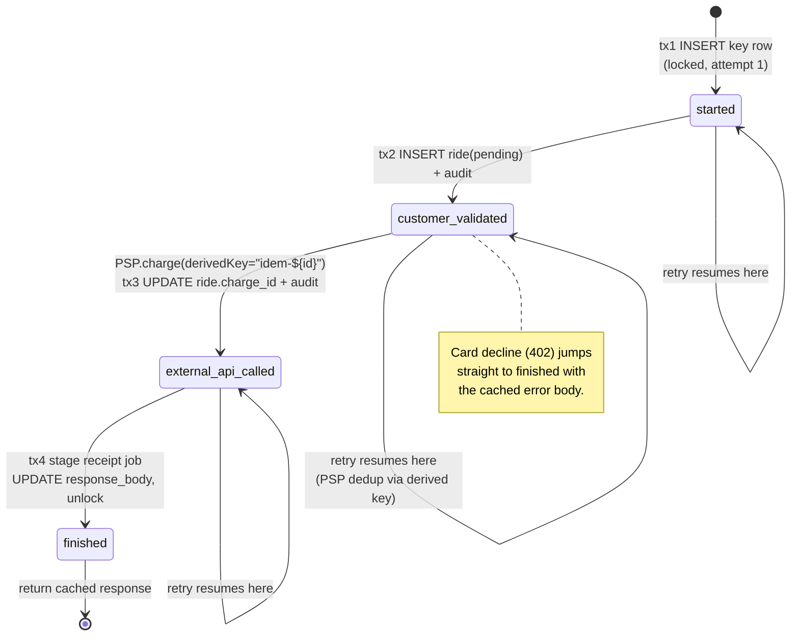
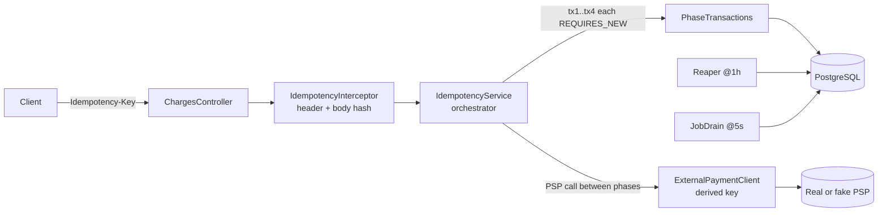

# IdemEngine — Stripe-style idempotency keys in Postgres

A reference implementation of the `Idempotency-Key` contract in Java 17 +
Spring Boot 3 + PostgreSQL 15, built around a four-phase recovery-point state
machine and a derived idempotency key for the downstream payment provider.

**Every claim in this file maps to a named test.** The mapping is the table in
§6, and the numbers behind it are in [METRICS.md](METRICS.md). Observed result
of `./gradlew clean test` on the machine described there: **28 tests, 0
failures, 0 errors.**

---

## 1. What is actually guaranteed

The word "exactly once" is doing too much work in most write-ups of this
pattern, so here is the precise contract, with the conditions it depends on.

**Given** a client that retries with the same `Idempotency-Key` and the same
request body, and a payment provider that deduplicates on the derived key it is
handed:

1. **At most one charge per `(user_id, key)` within the TTL.** No sequence of
   client retries, concurrent duplicates, process crashes, or provider timeouts
   in the tested set produces a second charge.
   → F1–F8, `concurrentRequestsExecuteOnce`
2. **Byte-identical replay.** Once a request reaches `finished`, every later
   retry with the same body gets the same status code and the same response
   bytes, read back from Postgres.
   → `f4_dbSuccessThenResponseLost`, `retryReturnsIdenticalBytes`,
   `f8_duplicateDeliveryAfterRestart`
3. **Same key, different body → 422**, never a silent replay of the wrong
   response, and never a second charge.
   → `duplicateKeyDifferentBodyRejects`, `bodyMismatchOverHttp`
4. **A duplicate that arrives while the original is in flight gets 409 with a
   retry hint**, not a duplicate side effect and not a hang.
   → `f1_duplicateBeforeProcessing`, `f2_duplicateWhileInFlight`
5. **Recovery is bounded by lock staleness, not by human intervention.** A
   process that dies mid-request leaves a locked row; after the staleness
   window any other process reclaims it and resumes from the persisted
   recovery point.
   → `f3`, `f5`, `f6`, `f7a`, `f7b`

**What is deliberately not claimed:**

- **Not "exactly once" in general.** The system is *effectively once*: delivery
  is at-least-once (the client retries) and handling is idempotent. There is no
  exactly-once delivery here, and there cannot be — that is the standard
  two-generals result, and Kleppmann's framing in *DDIA* ch. 11 is the one this
  follows.
- **Not "at most once" past the TTL.** After `idempotency.ttl` (24h default) the
  key row is treated as if it never existed, and reusing the key produces a
  genuinely new charge. This is intended and it is tested, not glossed over.
  → `expiredKeyAllowsNewRequest`
- **Not stronger than the provider.** The at-most-once property across the
  network boundary is inherited from the provider's own deduplication on the
  derived key `"idem-" + idempotency_keys.id`. If the provider does not honour
  it, this system guarantees at-most-once only up to its own boundary. The
  suite verifies the property against a fake provider that deduplicates the way
  Stripe documents; that is a model of Stripe, not Stripe.
- **Not authenticated.** See §7.

---

## 2. Why the problem is hard

> "Networks are unreliable. We've all experienced trouble connecting to Wi-Fi,
> or had a phone call drop on us abruptly."
>
> — Brandur Leach, [Designing robust and predictable APIs with idempotency](https://stripe.com/blog/idempotency), Stripe Engineering, 2017.

When a client calls `POST /charges` and the response is lost, the client cannot
distinguish "the charge did not happen" from "the charge happened and the
acknowledgement was lost". Both naïve responses are wrong: retry and risk
double-charging, or don't retry and risk silently dropping revenue.

The resolution is to move the hard part to the server. The client attaches an
`Idempotency-Key` and retries blindly on any ambiguous failure; the server
absorbs the duplicates. The interesting engineering is not the happy path — it
is that the server itself can die at any point, including in the window between
"the provider took the money" and "we wrote down that the provider took the
money".

---

## 3. The state machine



Two details carry the whole design:

**The recovery point is committed in the same transaction as the work of its
phase.** Each phase is `@Transactional(propagation = REQUIRES_NEW)` in
`PhaseTransactions`, so the cursor on disk can never disagree with the data on
disk. A crash between phases leaves a recovery point that exactly describes
what committed.

**The provider call happens between transactions, not inside one.** It is the
only step that is not transactional, which is precisely why it needs the derived
key: on retry the same `"idem-" + rowId` is reconstructed from the durable row,
so the provider recognises the call and returns the original charge rather than
making a new one.

See [DESIGN.md](DESIGN.md) for the sequence diagrams.

---

## 4. Architecture



| Component | Responsibility |
|---|---|
| `IdempotencyInterceptor` | Validate `Idempotency-Key`, read the demo identity header, canonicalize and hash the body. |
| `IdempotencyService` | Orchestrator. Owns the state-machine loop. **No `@Transactional`.** |
| `PhaseTransactions` | All `@Transactional(REQUIRES_NEW)` methods — acquire plus the four phases. |
| `ExternalPaymentClient` | Provider boundary. The derived idempotency key is a required parameter, not an option. |
| `ChargeService` | Stateless parse / response-building. |
| `Reaper` | Deletes expired key rows. Interval configurable via `jobs.reaper.*`. |
| `JobDrain` | Polls `staged_jobs`. Interval configurable via `jobs.drain.*`. |

---

## 5. Design decisions

| # | Decision | Chosen | Rejected alternative, and why |
|---|---|---|---|
| 1 | Storage | PostgreSQL 15+ | Redis (TTL + Lua) — no transactional coupling between the cursor and the business rows |
| 2 | Key uniqueness scope | `UNIQUE (user_id, key)` | Global `UNIQUE (key)` — a leaked key would be replayable across tenants |
| 3 | Request fingerprint | SHA-256 of the canonicalized body | Full-body compare — slower and sensitive to formatting |
| 4 | TTL | 24h, configurable | 72h (Brandur's pick, to survive a Friday bug); 24h matches Stripe's public contract |
| 5 | Concurrency | `SELECT … FOR UPDATE` + `locked_at` staleness | `pg_advisory_xact_lock` — invisible in `pg_stat_activity`, harder to debug |
| 6 | Recovery granularity | Four phases | A single `seen` boolean — cannot resume *past* the provider call, which is the only failure point that costs money |
| 7 | Derived provider key | `"idem-" + idempotency_keys.id` | A fresh UUID per attempt — defeats the provider's deduplication entirely |
| 8 | Column type for the digest | `VARCHAR(64)` | `CHAR(64)` — Postgres reports it as `bpchar`, which does not match the JPA mapping and breaks `ddl-auto: validate` |
| 9 | Hibernate DDL mode | `validate` | `none` — it hides exactly the drift in row 8, which is how that bug survived |

---

## 6. Claim → test map

Every row is a claim this README makes and the test that holds it up. Run
`./gradlew clean test` to check all of them: **28 tests, 0 failures**
([METRICS.md](METRICS.md)).

### The eight failure points

Each of these tests asserts four things — the **side-effect count** (rides,
staged jobs, unique provider charges), the **idempotency-record state**
(`recovery_point`, `response_code`, `locked_at`, `attempt_no`), the **final
charge state** (`rides.status`, `psp_charge_id`), and the **recovery path taken**
(the `audit_logs` trail, which distinguishes `lock_conflict` from
`lock_reclaimed` from `cache_hit`). The fourth matters: "exactly one charge" is
also true of a system that silently did nothing, and only the audit trail tells
the two apart.

All nine live in
[`src/test/java/io/github/sumansinghs71/idempotency/failure/FailureModeTest.java`](src/test/java/io/github/sumansinghs71/idempotency/failure/FailureModeTest.java).

| # | Failure | Recovery mechanism | Test |
|---|---|---|---|
| F1 | Duplicate delivered **before processing begins** | The original holds a fresh `locked_at`; the duplicate gets 409 and creates nothing | `f1_duplicateBeforeProcessing` |
| F2 | Duplicate delivered **while in flight**, after the ride row exists | Same live-lock rejection, one state further into the DAG; the pending ride is not duplicated | `f2_duplicateWhileInFlight` |
| F3 | **Provider succeeded, then our DB commit failed** | tx3 rolls back, so the recovery point never advances; `releaseLockOnError` unlocks; the retry re-issues with the same derived key and the provider deduplicates | `f3_pspSuccessThenDbCommitFailure` |
| F4 | **DB committed, response lost on the wire** | The `finished` row holds the cached response; the retry replays it byte for byte without touching the provider | `f4_dbSuccessThenResponseLost` |
| F5 | **Crash before the provider call** | Stale lock reclaimed; resume from `customer_validated`; the provider is called exactly once, ever | `f5_crashBeforePsp` |
| F6 | **Crash after the provider succeeded**, outcome known to the dead process and lost with it | The derived key is reconstructible from the durable row id, so the retry recovers the *same* `charge_id` | `f6_crashAfterPsp` |
| F7 | **Ambiguous timeout** — we cannot tell whether the card was charged | No recovery point is committed for an outcome never observed; the retry resolves the ambiguity via the derived key. Tested from **both** sides | `f7a_ambiguousTimeout_pspDidCharge`, `f7b_ambiguousTimeout_pspDidNotCharge` |
| F8 | **Duplicate delivered after the application restarted** | All durable state is in Postgres. The test boots a genuinely separate Spring context — new beans, empty in-memory provider store — and the replay is served from the database with **zero** provider calls | `f8_duplicateDeliveryAfterRestart` |

F3 is worth calling out: the DB commit failure is injected with a real Postgres
trigger that aborts the `rides` update, so the provider genuinely charges and our
transaction genuinely rolls back. It reproduces "the money moved and we have no
record of it" rather than simulating it.

### The rest of the contract

| Claim | Test | File |
|---|---|---|
| One request → 201, one ride, one charge, one staged job, three `phase_committed` audit rows | `happyPathChargesOnce` | `integration/IdempotencyIntegrationTest` |
| Same key + same body → cached response, no second provider call | `duplicateKeyReturnsCachedResponse` | same |
| Same key + different body → 422; the original response still replays | `duplicateKeyDifferentBodyRejects` | same |
| Past the TTL the key is reusable and produces a new charge | `expiredKeyAllowsNewRequest` | same |
| The same key string from two users does not collide | `keyCollisionAcrossUsersAllowed` | same |
| A card decline caches as 402 and is not re-sent to the provider; no receipt is staged | `declinedChargeIsCachedAndNotRetriedAtThePsp` | same |
| `JobDrain` deletes the staged receipt; a second tick is a no-op | `jobDrainProcessesStagedJob` | same |
| `Reaper` deletes expired keys and leaves rides and audit rows behind (`ON DELETE SET NULL`) | `reaperDeletesExpiredKeysButKeepsRides` | same |
| 100 concurrent copies → 1 ride, 1 charge; every thread gets 201 or 409 with a retry hint | `concurrentRequestsExecuteOnce` | `integration/ConcurrencyTest` |
| `POST /charges` over HTTP returns 201 | `happyPathOverHttp` | `web/HttpContractTest` |
| A retried POST returns identical bytes and charges once | `retryReturnsIdenticalBytes` | same |
| Missing `Idempotency-Key` → 400, nothing charged | `missingIdempotencyKeyRejected` | same |
| Key longer than the column → 400 | `oversizeIdempotencyKeyRejected` | same |
| Non-JSON body → 400 before any row is created | `invalidJsonRejected` | same |
| Same key + different body over HTTP → 422 | `bodyMismatchOverHttp` | same |
| `X-User-Id` is an unverified header that anyone can set (§7) | `xUserIdIsAnUnverifiedDemoShim` | same |
| Body hashing is key-order insensitive and value sensitive | `canonicalizationIsKeyOrderInsensitive`, `hashesMatchAcrossKeyOrders`, `hashChangesWhenValueChanges` | `unit/RequestHashTest` |

---

## 7. `X-User-Id` is a development/demo identity shim, not authentication

**`X-User-Id` is a development/demo identity shim.** It is read verbatim from the
request and trusted as-is. It is **not** authentication and carries **no**
security property: anyone who can reach the endpoint can claim to be any user by
setting the header, and can thereby read that user's cached idempotent responses.

It exists only so that the state machine — whose uniqueness scope is
`(user_id, key)` — has a `user_id` to key on, without pulling an auth stack into
a reference implementation. `xUserIdIsAnUnverifiedDemoShim` asserts this
weakness explicitly, so that the documentation cannot quietly drift into calling
it authentication.

Consequently the 401 returned when the header is missing or unparseable is an
input-validation response, not an authentication decision.

**Deploying this as-is on an untrusted network would be a broken-access-control
vulnerability.** A real deployment must delete the header handling and derive the
principal from a verified credential — a Spring Security filter chain ahead of
this interceptor, populating `SecurityContextHolder` from a session, OAuth2/JWT
bearer token, or mTLS certificate — and read the user id from that principal.
Nothing else in `IdempotencyInterceptor` changes. The same note is on that
class's javadoc.

---

## 8. Quickstart

The whole path below is what
[`scripts/verify-fresh-start.sh`](scripts/verify-fresh-start.sh) runs, with an
assertion after every step. It deletes the Postgres volume before it starts, so
it cannot pass on leftover state, and it exits non-zero on the first assertion
that does not hold:

```sh
./scripts/verify-fresh-start.sh
```

It destroys the volume, starts Postgres, checks the database really is empty,
builds the jar, starts the app, checks that Flyway migrated and then seeded,
issues a charge plus its replay plus a mismatched body, checks the resulting
rows, and shuts everything down.

### The same sequence by hand

```sh
# 1. Postgres, on a fresh volume. Published on host port 5433, not 5432, so a
#    natively installed Postgres can never be mistaken for the container.
docker compose down -v            # only needed if you have run it before
docker compose up -d postgres

# 2. Run the app. `bootRun` activates the `dev` profile, so Flyway migrates the
#    schema and then runs its afterMigrate callback, which seeds the demo user.
#    Both happen inside one migrate() call, before the context finishes starting.
./gradlew bootRun

# 3. Exercise the wire contract. `1` is the id of the seeded user.
./scripts/smoke-test.sh 1
```

**Schema and fixtures are both owned by Flyway, and that is the whole point.**
An earlier version of this quickstart seeded with `psql < scripts/seed-dev-user.sql`
between `docker compose up` and `./gradlew bootRun`. On a fresh database that
step fails with `relation "users" does not exist`, because nothing has migrated
yet — the app is what runs Flyway, and it has not started. The fix was to delete
the separate seeding step rather than to reorder it: the fixtures now live in
[`src/main/resources/db/seed/afterMigrate__seed_dev_fixtures.sql`](src/main/resources/db/seed/afterMigrate__seed_dev_fixtures.sql),
a Flyway callback that can only run after the migrations it depends on. There is
no second seeding mechanism left to disagree with the first.

That file is reached only through the `dev` profile, which is the sole thing
that adds `classpath:db/seed` to `spring.flyway.locations`. The default profile
and the `test` profile never see it, so no deployment and no test run is seeded
with demo data. The insert is `ON CONFLICT DO NOTHING`, so restarting the app
against an existing database is a no-op.

Database name, user, and password are `idempotency` / `idem` / `idem` in
`docker-compose.yml`, in `application.yml`'s defaults, and in every script and
document here. Override them with `DB_URL`, `DB_USERNAME`, `DB_PASSWORD` (app)
and `POSTGRES_DB`, `POSTGRES_USER`, `POSTGRES_PASSWORD`, `POSTGRES_PORT`
(compose). If 5433 is taken on your machine too:

```sh
POSTGRES_PORT=5434 docker compose up -d postgres
DB_URL=jdbc:postgresql://localhost:5434/idempotency ./gradlew bootRun
```

Other commands:

```sh
./gradlew clean test    # requires a working Docker for Testcontainers
./gradlew clean build   # compile, test, and produce build/libs/idem-engine-0.1.0.jar
./gradlew jmh           # benchmarks -> benchmarks/jmh-results.json
docker compose up -d    # adds the optional stack: Toxiproxy, Prometheus, Grafana
```

The build declares a Java 17 toolchain and resolves it from whatever JDKs are
installed; no JDK path is hardcoded anywhere. `.github/workflows/ci.yml` runs
`./gradlew clean build` — the same full suite — on every push and pull request.

| Also useful | File |
|---|---|
| Fresh-database verification | [`scripts/verify-fresh-start.sh`](scripts/verify-fresh-start.sh) |
| Wire-contract smoke test | [`scripts/smoke-test.sh`](scripts/smoke-test.sh) |
| Dev fixtures (Flyway callback) | [`src/main/resources/db/seed/afterMigrate__seed_dev_fixtures.sql`](src/main/resources/db/seed/afterMigrate__seed_dev_fixtures.sql) |
| DB-state inspection | [`scripts/inspect.sql`](scripts/inspect.sql) — `PGPASSWORD=idem psql -U idem -d idempotency -h localhost -p 5433 -f scripts/inspect.sql` |
| Postman collection | [`postman/IdemEngine.postman_collection.json`](postman/IdemEngine.postman_collection.json) |

---

## 9. Known gaps

Named here rather than left for a reader to discover:

- **Toxiproxy is wired but unused.** The service is in `docker-compose.yml` and
  `infra/toxiproxy.json` exists, but no test drives it. All failure injection in
  the suite is in-process. That exercises the recovery logic; it does not
  exercise TCP-level pathologies such as half-open connections.
- **No completer process.** Brandur's third process — sweep rows older than a few
  minutes that are not `finished` and push them through — is not implemented. A
  client that abandons a request after one attempt leaves a row stranded at its
  recovery point until the TTL expires it. Sketched in `DESIGN.md §6`.
- **No lock-extend heartbeat.** A JVM pause longer than `lock-staleness` would
  let a peer reclaim a row that is still live. At low volume the 90s default is
  ample margin; at high volume this needs a heartbeat refreshing `locked_at`.
- **Single Postgres primary.** Sharding, partitioned `audit_logs`, an outbox to
  Kafka for `staged_jobs`, and the multi-region question are all discussed in
  `DESIGN.md`; none of them are implemented or measured here.
- **Benchmarks are single-threaded and local.** See the "What is not measured"
  section of [METRICS.md](METRICS.md).

---

## 10. References

- Brandur Leach, [Designing robust and predictable APIs with idempotency](https://stripe.com/blog/idempotency), Stripe Engineering, 2017.
- Brandur Leach, [Implementing Stripe-like Idempotency Keys in Postgres](https://brandur.org/idempotency-keys), 2017. Reference repo: [`brandur/rocket-rides-atomic`](https://github.com/brandur/rocket-rides-atomic).
- DeepWiki, [Idempotency and Retry Logic — `stripe/stripe-node`](https://deepwiki.com/stripe/stripe-node/3.5-idempotency-and-retry-logic). The client-side mirror of this contract: exponential backoff (0.5s → 5s cap), jitter, auto-generated `stripe-node-retry-{uuid}` keys, retry on 409 / 5xx / connection errors.
- Martin Kleppmann, *Designing Data-Intensive Applications* (O'Reilly, 2017). Ch. 8 on unreliable networks and partial failure; ch. 11 §"Idempotence" on building effectively-once semantics from at-least-once delivery plus idempotent operations — the framing used in §1.

## Design trail

[PRD.md](PRD.md), [TRD.md](TRD.md), [DESIGN.md](DESIGN.md), [APP_FLOW.md](APP_FLOW.md), [PLAN.md](PLAN.md), [RESEARCH.md](RESEARCH.md), [BLOG.md](BLOG.md), [METRICS.md](METRICS.md).
