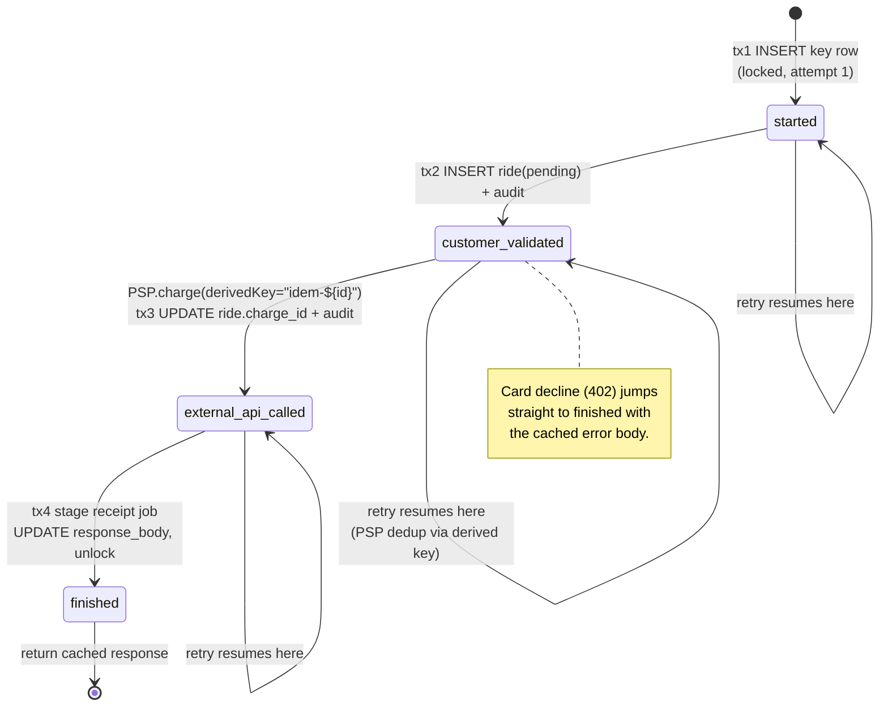
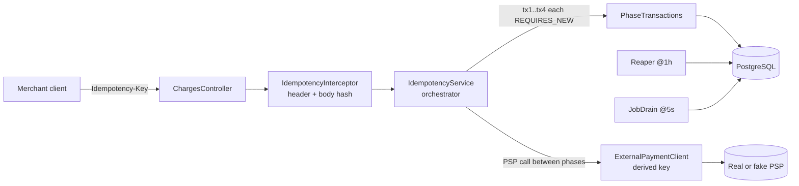

# Idempotent REST APIs: an implementation following Stripe's design

> A production-grade, Stripe-style idempotency system in Java 17 + Spring Boot 3 + PostgreSQL. Charges a customer exactly once, even when the network or our own process crashes at any of eight enumerated failure points. Recovers from all of them in tests.

**Status:** reference implementation. Rename the package `com.yourname.idempotency` before shipping.

---

## 1. Why this exists

> "Networks are unreliable. We've all experienced trouble connecting to Wi-Fi, or had a phone call drop on us abruptly. The networks connecting our servers are, on average, more reliable than consumer-level last miles, but given enough information moving across the wire, they're still going to fail in exotic ways."
>
> — Brandur Leach, [Designing robust and predictable APIs with idempotency](https://stripe.com/blog/idempotency), Stripe Engineering, 2017.

When a merchant's client calls `POST /charges` and the response packet is lost on the wire, the client doesn't know whether the customer was charged. The naïve options are both wrong: assume failure and retry — and risk double-charging; assume success and not retry — and risk silently dropping the merchant's revenue. The customer doesn't care which: they will be upset and the merchant will own a support ticket.

The contract that resolves this — established by Stripe in 2017 and described in detail by Brandur Leach's [companion post on the implementation](https://brandur.org/idempotency-keys) — is to make the server *exactly-once* under retries: the client attaches an `Idempotency-Key` header, the server uses it to absorb every duplicate so the customer is charged at most once, and the merchant receives the byte-identical response on every retry. The client retries blindly on any ambiguous failure; the server does the hard part.

This repo is a careful, opinionated implementation of that server contract in Spring Boot 3, with a four-phase recovery-point state machine in Postgres, a derived idempotency key for the downstream PSP call, and chaos tests that prove the customer is charged exactly once through every failure mode the design recognises.

## 2. The state machine



The states are committed atomically with the local mutations of each phase. A crash between phases leaves a recovery point that exactly matches what's on disk. A retry reads the recovery point and jumps in at the right place. See [DESIGN.md](DESIGN.md) for the full state-machine + 4 sequence diagrams.

## 3. Architecture overview



| Component | Responsibility |
|---|---|
| `IdempotencyInterceptor` | Extract `Idempotency-Key`, validate, resolve `user_id`, canonicalize body, hash. |
| `IdempotencyService` | Orchestrator. Owns the state-machine loop. **No `@Transactional`.** |
| `PhaseTransactions` | Holds all `@Transactional(REQUIRES_NEW)` methods — acquire + the 4 phases. |
| `ExternalPaymentClient` | Boundary to the PSP. Requires a derived idempotency key as a parameter. |
| `ChargeService` | Stateless business logic (parse, build response body). |
| `Reaper` | Hourly delete of expired key rows. |
| `JobDrain` | 5-second poll of `staged_jobs` for receipt-send and similar. |

## 4. Design decisions

The seven decisions that shaped the system. Each lists the alternatives considered and the canonical choice. See [TRD.md §2](TRD.md) for the full version.

| # | Decision | Chosen | Alternatives considered |
|---|---|---|---|
| 1 | Storage | **PostgreSQL 15+** | Redis (TTL + Lua), DynamoDB conditional writes |
| 2 | Key uniqueness scope | **`UNIQUE (user_id, key)`** | Global `UNIQUE (key)` (rejected — leaked key would be replayable cross-tenant) |
| 3 | Request fingerprint | **SHA-256 of canonical body** | Full body compare (slower, format-fragile) |
| 4 | TTL | **24h default**, configurable | 72h (Brandur's pick — survive a Friday bug); we pick 24h to match Stripe's public contract |
| 5 | Concurrency | **`SELECT … FOR UPDATE` + `locked_at` (90s staleness)** | `pg_advisory_xact_lock` (rejected — harder to debug; less observable) |
| 6 | Recovery-point granularity | **4 phases**: started → customer_validated → external_api_called → finished | Single boolean (rejected — cannot resume past PSP call) |
| 7 | Derived key for PSP | **`"idem-" + idempotency_keys.id`** | Random UUID per attempt (rejected — defeats nested idempotency) |

**Why these together?** The Postgres + per-user key + per-phase transaction trio gives you ACID semantics for the *cursor* (the recovery point) and the *work*. The derived key gives you ACID-equivalent guarantees across the PSP boundary because the PSP dedupes on it. The `locked_at` timestamp gives you cross-transaction mutual exclusion that auto-recovers from dead holders without human intervention. Each decision plugs a specific failure class; remove one and the design has a known hole.

## 5. Failure modes recovered

Eight enumerated failure points, with the test that proves each. See `src/test/java/com/yourname/idempotency/`.

| # | Failure | Recovery mechanism | Test |
|---|---|---|---|
| F1 | Network drop before request lands | Client retries; server creates row fresh | `testHappyPath` (degenerate) |
| F2 | Crash mid-`tx1` | `tx1` rolls back atomically; next attempt INSERTs | `testConcurrentRequestsExecuteOnce` (race covers this) |
| F3 | Crash after `tx1`, before `tx2` | `locked_at` becomes stale; retry reclaims | `testCrashAfterDbCommit*` (variant) |
| F4 | Crash mid-`tx2` | `tx2` rolls back; retry resumes at `started`; ride row idempotent on `(user_id, key_id)` unique | implicit in F3/F5 paths |
| F5 | PSP network timeout | Retry calls PSP with same derived key | `testCrashDuringExternalApiCallNoDoubleCharge` |
| F6 | **Crash after PSP success, before `tx3` commit** | Retry hits PSP cache via derived key → identical `charge_id` → `tx3` commits | **`testCrashDuringExternalApiCallNoDoubleCharge`** (the hard one) |
| F7 | Crash mid-`tx4` | `tx4` rolls back; `external_api_called` row still has `psp_charge_id`; retry resumes from `external_api_called`; `ON CONFLICT DO NOTHING` keeps staged_jobs idempotent | `testCrashAfterDbCommitBeforeResponseRecoversCorrectly` |
| F8 | Response lost on the wire | `finished` row stays; retry returns cached body | `testDuplicateKeyReturnsCachedResponse` |

Other named tests cover the rest of the contract:

- `testDuplicateKeyDifferentBodyRejects` — FR-3 (422 on mismatched body).
- `testExpiredKeyAllowsNewRequest` — FR-6 (TTL).
- `testKeyCollisionAcrossUsersAllowed` — FR-7 (per-user scoping).
- `testConcurrentRequestsExecuteOnce` — FR-4 (100 threads, same key → exactly 1 charge).

## 6. Benchmarks

A JMH harness lives at `src/jmh/java/com/yourname/idempotency/IdempotencyBenchmark.java`. It boots the full app against a Testcontainers Postgres and measures the two paths that matter:

- **Cached-path throughput.** Same key, body already finished — one indexed read + the unlock check.
- **Unique-key throughput.** Fresh key every iteration — full state-machine pass (tx1..tx4 + one fake-PSP call).

Run it locally:

```sh
./gradlew jmh
```

> Per the project's "no fabricated numbers" rule, this README intentionally does **not** ship example numbers. The output of `./gradlew jmh` writes to `benchmarks/jmh-results.json` and `benchmarks/jmh-output.txt` — paste your local figures there. Numbers from someone else's machine are misleading.

Useful comparisons to compute from your local run:

| Path | Expected shape |
|---|---|
| Cached vs unique throughput | Cached should be **much** faster — work is skipped after one indexed read. |
| p99 at threads = 1, 10, 100 | Should stay flat until the DB connection pool saturates. |
| Lock-wait timer (Micrometer) | Should be near-zero in steady state; spikes signal contention. |

## 7. What I'd do differently at scale

A single Postgres primary tops out around tens of thousands of `POST /charges`/sec. The design changes when you go past that:

1. **Shard `idempotency_keys` by `user_id`.** Per-user is already the unique constraint, so a hash shard on `user_id` is natural and preserves row-locality of all of a user's keys. Use `pg_partman` for time-partitioned `audit_logs` (which grows fastest).
2. **Move expiry to a separate process.** The in-process `@Scheduled` reaper is fine at small scale; past ~1M rows/h, run it as a job on its own pod with `LIMIT … FOR UPDATE SKIP LOCKED` batches so deletes don't block writes.
3. **Async fan-out of `staged_jobs`.** The poll-and-delete drain doesn't scale past a few hundred jobs/s. Switch to a Kafka producer that publishes from the staging table (transactional outbox); a separate consumer set sends emails / webhooks at rate.
4. **Multi-region.** This is the genuinely hard one. You either accept that idempotency is single-region (route a `(user_id, key)` to a fixed home region and tolerate a brief outage on regional failover), or you move the key store to something with global serializability (Spanner/CockroachDB). Two-phase commit between regions is rarely worth its complexity, mirroring the caveat in Brandur's post.
5. **Lock-extend heartbeat.** Today, a JVM stop-the-world pause >90s would let a peer reclaim a still-live row. At >100k req/s I'd add a heartbeat job that refreshes `locked_at` every 30s while a phase is in flight. Costs one UPDATE per second of in-flight work — cheap insurance.
6. **A completer.** Brandur's third process: scan rows older than 5 minutes and not `finished`, attempt to push them through to completion. It defends against clients that drop forever after a single attempt. Out of scope here; sketched in `DESIGN.md §6`.

## 8. References

- Brandur Leach, [Designing robust and predictable APIs with idempotency](https://stripe.com/blog/idempotency), Stripe Engineering, 2017.
- Brandur Leach, [Implementing Stripe-like Idempotency Keys in Postgres](https://brandur.org/idempotency-keys), 2017. The reference repo: [`brandur/rocket-rides-atomic`](https://github.com/brandur/rocket-rides-atomic).
- DeepWiki, [Idempotency and Retry Logic — `stripe/stripe-node`](https://deepwiki.com/stripe/stripe-node/3.5-idempotency-and-retry-logic). Client-side mirror of this contract: exponential backoff (0.5s → 5s cap), jitter, auto-generated `stripe-node-retry-{uuid}` keys, retry on 409 / 5xx / connection-error.
- Martin Kleppmann, *Designing Data-Intensive Applications* (O'Reilly, 2017). Chapter 8 (*The Trouble with Distributed Systems*) on unreliable networks and partial failure; Chapter 11 (*Stream Processing*) §"Atomic commit revisited" and §"Idempotence" on building effectively-once semantics out of at-least-once delivery plus idempotent operations.

## How to run

```sh
# infra
docker compose up -d

# build + test
./gradlew clean test

# run the app
./gradlew bootRun

# JMH benchmarks
./gradlew jmh
```

## How to validate (after bootRun)

| What | File | One-liner |
|---|---|---|
| Wire-contract smoke test | [`scripts/smoke-test.sh`](scripts/smoke-test.sh) | `./scripts/smoke-test.sh 1` |
| Postman collection | [`postman/IdemEngine.postman_collection.json`](postman/IdemEngine.postman_collection.json) | Import → Run Collection |
| DB-state inspection | [`scripts/inspect.sql`](scripts/inspect.sql) | `psql -U idem_app -d vector_store_idem -h localhost -f scripts/inspect.sql` |
| Browsable DeepWiki-style doc | [`docs/wiki.html`](docs/wiki.html) | `open docs/wiki.html` |

## Design trail

See [PRD.md](PRD.md), [TRD.md](TRD.md), [DESIGN.md](DESIGN.md), [APP_FLOW.md](APP_FLOW.md), [PLAN.md](PLAN.md), [RESEARCH.md](RESEARCH.md), and [BLOG.md](BLOG.md) for the full design trail.

---

**Reminder:** the package `com.yourname.idempotency` is a placeholder — rename it to your namespace before shipping.
